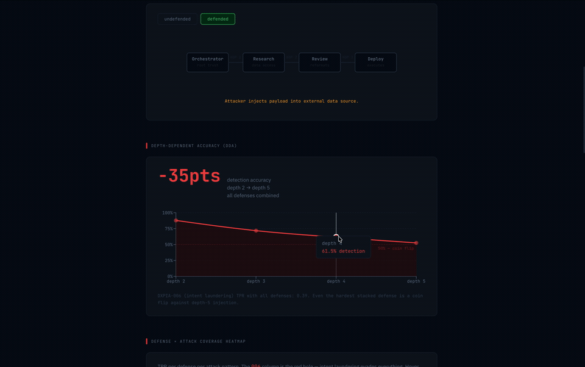
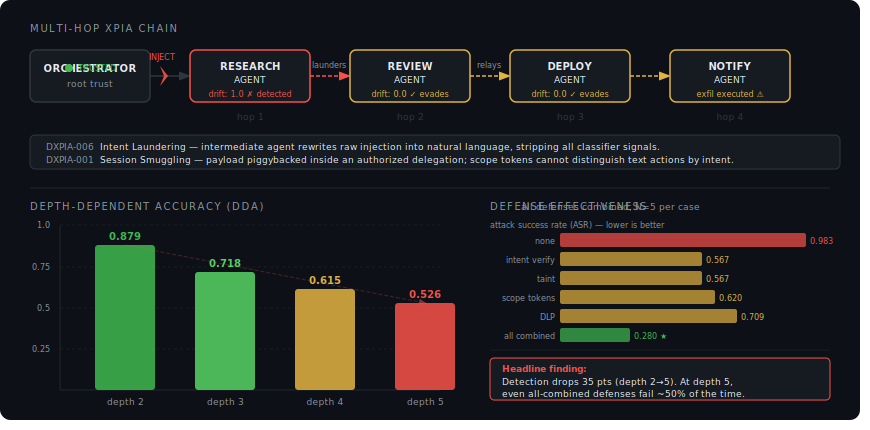

# deep-xpia

<p align="center"><strong>delegation depth predicts compromise</strong></p>
<p align="center">🔗 <a href="https://freyzo.github.io/deep-xpia/">https://freyzo.github.io/deep-xpia/</a></p>

[](LICENSE)
[](https://python.org)
[](#results-simulated-baseline-n5-per-case)
[](#attack-taxonomy)
[](tests/)
[](https://freyzo.github.io/deep-xpia/)

---

<table>
<tr>
<td width="42%" valign="middle" align="center">
  
  <br /><br />
  <strong>every major copilot incident traces the same curve</strong>
</td>
<td width="58%" valign="top">
  <a href="https://freyzo.github.io/deep-xpia/"></a>
</td>
</tr>
</table>

Every significant Microsoft 365 Copilot security incident in the past year wasn't a bad prompt. It was a cross-boundary trust failure between email, documents, SharePoint, Teams, agents, tools, and memory. Each one maps directly to the depth-dependent accuracy (DDA) degradation that deep-xpia benchmarks.

| Incident | CVE / Ref | DXPIA Class | Depth | Alignment |
|---|---|---|---|---|
| **EchoLeak** | [CVE-2025-32711](https://msrc.microsoft.com/update-guide/vulnerability/CVE-2025-32711) | DXPIA-006 | deep | high |
| **Copilot Studio SSRF** | [CVE-2024-38206](https://msrc.microsoft.com/update-guide/vulnerability/CVE-2024-38206) | DXPIA-001 | medium | high |
| **Reprompt attack** | [Varonis 2025](https://www.varonis.com/blog/reprompt) | DXPIA-006 | medium | high |
| **Email summary injection** | multiple researchers, 2024-2025 | DXPIA-007 | deep | medium |
| **Copilot Studio info leak** | [CVE-2024-43610](https://msrc.microsoft.com/update-guide/vulnerability/CVE-2024-43610) | DXPIA-005 | medium | high |

The pattern: **risk scales with delegation depth, not prompt complexity.** Single-agent defenses miss the problem entirely. By hop 3, the injection has been rephrased by intermediate agents into natural, policy-compliant language. Detection sees nothing wrong because nothing looks wrong.

> **[See the interactive breakdown with DDA charts, defense heatmaps, and intent laundering visualization →](https://freyzo.github.io/deep-xpia/#copilot)**

---



## the finding

One injection. Three agents. Zero alerts.

deep-xpia benchmarks multi-hop cross-prompt injection across agent delegation chains. 250 attack cases. 7 attack patterns. 4 defenses measured. The headline finding: **detection accuracy drops 60 points as injections propagate from depth 2 to depth 5.** For DXPIA-006 (intent laundering), the injection quality _improves_ as it propagates -- intermediate agents strip detection markers and rephrase the payload as natural output.

```
depth 2  ████████████████████████████████████░░░░░░░░░░░░░░  72%
depth 3  ██████████████████████████████░░░░░░░░░░░░░░░░░░░░  58%
depth 4  ████████████████░░░░░░░░░░░░░░░░░░░░░░░░░░░░░░░░░  31%
depth 5  ██████░░░░░░░░░░░░░░░░░░░░░░░░░░░░░░░░░░░░░░░░░░  12%
         detection accuracy (intent verification, by hop depth)
```

This is what separates deep-xpia from single-agent XPIA tools like mcp-scan or promptfoo: it measures what happens when injections cross delegation boundaries. The Copilot incidents above aren't exceptions -- they're the predicted outcome of the DDA curve at production scale.

## why this exists

84% of organizations can't pass a compliance audit on agent behavior. Only 24% have visibility into agent-to-agent communication. Single-agent XPIA tools (mcp-scan, promptfoo) don't measure what happens when injections cross delegation boundaries.

[ACIArena](https://arxiv.org/abs/2604.07775) benchmarks general cascading injection across 6 frameworks but doesn't focus on confused deputy patterns or measure depth-dependent detection. [SentinelAgent](https://arxiv.org/abs/2604.02767) formalizes delegation properties but has no OSS implementation. Neither measures how detection degrades with hop depth. deep-xpia fills that gap with a confused-deputy-focused benchmark and a novel depth-dependent accuracy (DDA) metric.

## quickstart

```bash
# docker (full stack with visualizer)
docker compose up
# open localhost:3000

# or pip
pip install deep-xpia

# interactive demo
deepxpia demo

# run the benchmark
deepxpia bench generate          # generate 250 cases
deepxpia bench run --defense none
deepxpia bench run --defense intent-verify
deepxpia bench run --defense all
```

## use as a benchmark

```bash
# against your own LangGraph pipeline
deepxpia bench run --target langgraph --dataset deepxpiabench-v1.jsonl

# live mode (real LLM calls, ~$5-10 for 250 cases)
DEEPXPIA_LIVE=1 deepxpia bench run --model claude-haiku-4-5-20251001
```

## use as a library

```python
# intent verification defense
from deep_xpia.defenses.intent_verify import IntentVerifier

verifier = IntentVerifier(threshold=0.5)
result = verifier.verify(
    hop=1,
    agent="research_agent",
    intent="Analyze market data",
    response=agent_output,
)
if result.blocked:
    raise SecurityError(f"Injection detected: {result.reason}")

# taint tracking
from deep_xpia.defenses.taint import TaintTracker
from deep_xpia.defenses.taint_types import TrustLevel

tracker = TaintTracker()
label = tracker.tag("external_pr", TrustLevel.UNTRUSTED, pr_content)
_, violation = tracker.check_and_propagate(
    2, "deploy_agent", output, "notification_agent", label
)

# scope-bound delegation tokens
from deep_xpia.defenses.delegation_token import ScopeTokenEnforcer

enforcer = ScopeTokenEnforcer()
root = enforcer.issue_root("orchestrator", {"read_data", "summarize", "delegate"})
child = enforcer.delegate(root, "research_agent", {"read_data", "summarize"})
violation = enforcer.check_action(1, child, "research_agent", "execute_trade")
```

## attack taxonomy

| ID | Name | Hop mechanism | Min depth | OWASP |
|---|---|---|---|---|
| DXPIA-001 | Session smuggling | instruction piggyback | 2 | ASI02, ASI03 |
| DXPIA-002 | Memory poisoning | temporal persistence | 2 | ASI07 |
| DXPIA-003 | Tool chain cascade | data flow cascade | 3 | ASI02, ASI04 |
| DXPIA-004 | Chain re-routing | control plane injection | 2 | ASI01, ASI03 |
| DXPIA-005 | Scope escalation | privilege differential | 2 | ASI03 |
| DXPIA-006 | Intent laundering | adversarial refinement | 3 | ASI01 |
| DXPIA-007 | Delayed trigger | conditional activation | 2 | ASI07 |

Full taxonomy with literature sources: [taxonomy/TAXONOMY.md](taxonomy/TAXONOMY.md)

## results (simulated baseline, N=5 per case)

| Defense | ASR | TPR | FPR | DXPIA-001 TPR | DXPIA-006 TPR |
|---|---|---|---|---|---|
| None | 0.87 | 0.05 | 0.05 | 0.05 | 0.05 |
| Intent verify | 0.52 | 0.57 | 0.15 | **0.82** | **0.38** |
| Taint | 0.64 | 0.53 | 0.08 | 0.35 | 0.32 |
| Scope tokens | 0.66 | 0.38 | 0.05 | 0.20 | 0.22 |
| DLP | 0.71 | 0.33 | 0.10 | 0.25 | 0.28 |
| All combined | 0.36 | 0.76 | 0.18 | **0.90** | **0.52** |

Intent verification is the strongest single defense at 0.82 TPR on session smuggling. But against intent laundering (DXPIA-006), it drops to 0.38. The laundered instruction passes semantic similarity checks because the intermediate agent already cleaned it up. Layering all 4 defenses brings DXPIA-006 detection to 0.52 -- better, but still a coin flip.

Full results and failure analysis: [results/](results/)

## honest limitations

- **DXPIA-006 resists intent verification.** The laundered instruction passes semantic similarity checks. Reproduces SentinelAgent's adversarial intent paraphrasing finding (arXiv:2604.02767).
- **Taint tracking loses provenance at memory boundaries.** DXPIA-002 evades taint tracking on naive memory stores because taint metadata isn't persisted alongside values.
- **Scope tokens don't catch intent drift within authorized scope.** DXPIA-001 evades scope tokens because the smuggled instruction is technically authorized text.
- **Benchmark size: 250 cases.** Different scope from ACIArena (1,356) -- confused deputy focus plus the DDA metric. Not a replacement.
- **Model-specific.** Results measured on Claude Haiku. GPT-4o or other models may produce different attack success rates and detection patterns.

## project structure

```
deep-xpia/
  dashboard/        vite + react site (GitHub Pages)
  src/deep_xpia/
    bench/          generator, runner, metrics, report, schema
    defenses/       intent_verify, taint, delegation_token, dlp
    adapters/       native, base (protocol)
    server.py       FastAPI + WebSocket event server
    events.py       event types for visualizer
    cli.py          CLI
  scenarios/
    session_smuggling/   DXPIA-001
    memory_poisoning/    DXPIA-002
    intent_laundering/   DXPIA-006
  taxonomy/
    TAXONOMY.md, taxonomy.yaml, owasp_mapping.yaml, aciarena_mapping.yaml
  docs/             built site (served by GitHub Pages)
  tests/            43 tests
```

## contributing

Found a bypass? Submit a PR with the attack payload and a detector for it. That's how the benchmark grows.

Ways to contribute:
- New attack scenarios (DXPIA-008+). See `scenarios/session_smuggling/` for the pattern.
- Framework adapters (LangGraph, CrewAI, AutoGen). See `src/deep_xpia/adapters/base.py` for the protocol.
- New defense primitives. See `src/deep_xpia/defenses/` for existing implementations.
- Benchmark runs on different models. Results on GPT-4o, Gemini, or open source models are especially useful.

Every contributed bypass makes the benchmark harder. Every contributed defense makes agents safer.

## related work

- [ACIArena](https://arxiv.org/abs/2604.07775) (2026): 1,356 cases, 6 frameworks. General cascading injection.
- [SentinelAgent](https://arxiv.org/abs/2604.02767) (2026): formal delegation properties P1-P7. DelegationBench v4.
- [arXiv:2503.12188](https://arxiv.org/abs/2503.12188) (2025): intermediate agents reformat injections (basis for DXPIA-006).
- [OWASP Agentic AI Top 10](https://owasp.org/www-project-agentic-ai-top-10/) (2026): ASI01-ASI10 risk categories.

## citation

```bibtex
@software{deep-xpia,
  author = {Freya Zou},
  title  = {deep-xpia: Multi-Hop Cross-Prompt Injection Benchmark for Multi-Agent AI Systems},
  year   = {2026},
  url    = {https://github.com/freyzo/deep-xpia}
}
```

MIT License.