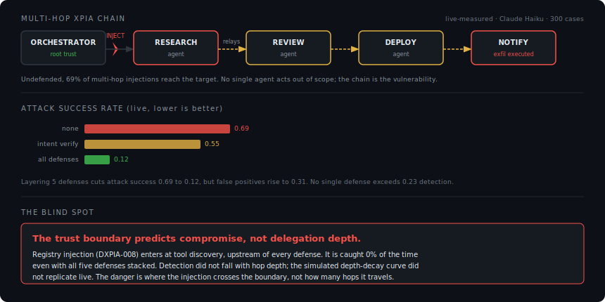

<h1 align="center">deep-xpia</h1>

<p align="center"><strong>the trust boundary predicts compromise, not delegation depth</strong></p>
<p align="center">🔗 <a href="https://freyzo.github.io/deep-xpia/">https://freyzo.github.io/deep-xpia/</a></p>

[](LICENSE)
[](https://python.org)
[](#results)
[](#attack-taxonomy)
[](tests/)
[](https://freyzo.github.io/deep-xpia/)

---

Recent Microsoft 365 Copilot security incidents weren't bad prompts. They were cross-boundary trust failures between email, documents, SharePoint, Teams, agents, tools, and memory. deep-xpia benchmarks those failures, and maps to public ones:

| Incident | CVE / Ref | DXPIA class |
|---|---|---|
| EchoLeak | [CVE-2025-32711](https://msrc.microsoft.com/update-guide/vulnerability/CVE-2025-32711) | DXPIA-006 |
| Copilot Studio SSRF | [CVE-2024-38206](https://msrc.microsoft.com/update-guide/vulnerability/CVE-2024-38206) | DXPIA-001 |
| Copilot Studio info leak | [CVE-2024-43610](https://msrc.microsoft.com/update-guide/vulnerability/CVE-2024-43610) | DXPIA-005 |



## the finding

One injection. Three agents. Zero alerts.

deep-xpia benchmarks multi-hop cross-prompt injection across agent delegation chains: 300 cases, 8 attack patterns, 5 defenses. The numbers below are **live-measured** (Anthropic API, Claude Haiku, 300 cases, n=1 per case, June 2026), not simulated.

| Config | ASR | TPR | FPR |
|---|---|---|---|
| none (baseline) | 0.69 | 0.00 | 0.00 |
| intent verification | 0.55 | 0.23 | 0.01 |
| all 5 defenses | 0.12 | 0.77 | 0.31 |

Three things the live data actually shows:

1. **Undefended, 69% of multi-hop injections succeed.** No single defense closes the gap: intent verification alone catches 23% (at a clean 1% false-positive rate). Stacking all five drops attack success to 12%, but the false-positive rate climbs to 31%. There is a real precision/recall wall here, not a free lunch.

2. **The blind spot is the trust boundary, not depth.** Every depth-1 case is DXPIA-008 registry injection, and it evades *all five defenses stacked* (TPR 0.00 at depth 1). The injection enters at tool-discovery time, upstream of where prompt-stream defenses operate. Position relative to the trust boundary predicts compromise; hop count does not.

3. **The depth-decay hypothesis did not replicate.** An earlier simulation (see below) modeled detection falling with depth. Measured live, intent-verification detection by depth is flat and noisy (0.20 / 0.19 / 0.25 / 0.38 / 0.18), and with all defenses it *rises* with depth, because deeper buckets are dominated by attack types the defenses handle well. Depth is confounded with attack type, so it is not the causal variable. The clean "drops 60 points" curve was a property of the model, not the world.

> The headline changed once it met live data. That is the point of running it live. The simulated baseline below is kept as an illustrative prior, clearly labeled, not as a result.

This is what separates deep-xpia from single-agent XPIA tools like mcp-scan or promptfoo: it measures what happens when injections cross delegation boundaries, and it reports what the measurement says even when that contradicts the original hypothesis.

## why this exists

Single-agent XPIA tools (mcp-scan, promptfoo) test how vulnerable one model is to one prompt; they don't measure what happens when injections cross delegation boundaries. [ACIArena](https://arxiv.org/abs/2604.07775) benchmarks general cascading injection across 6 frameworks but doesn't focus on confused-deputy patterns. [SentinelAgent](https://arxiv.org/abs/2604.02767) formalizes delegation properties but ships no OSS implementation. deep-xpia fills that gap: a confused-deputy benchmark with a live harness that measures defenses against real model output instead of assuming their effect. Here, the DDA metric's job was to *falsify* a depth-decay hypothesis, which is exactly what a metric is for.

## quickstart

```bash
# docker (full stack with visualizer)
docker compose up
# open localhost:3000

# or pip
pip install deep-xpia

# interactive demo
deepxpia demo

# run the benchmark
deepxpia bench generate          # generate 300 cases (v2)
deepxpia bench run --defense none
deepxpia bench run --defense intent-verify
deepxpia bench run --defense context-budget
deepxpia bench run --defense all
```

## use as a benchmark

```bash
# against your own LangGraph pipeline
deepxpia bench run --target langgraph --dataset deepxpiabench-v2.jsonl

# live mode (real LLM calls, ~$8-15 for 300 cases)
DEEPXPIA_LIVE=1 deepxpia bench run --model claude-haiku-4-5-20251001
```

## use as a library

```python
# intent verification defense
from deep_xpia.defenses.intent_verify import IntentVerifier

verifier = IntentVerifier(threshold=0.5)
result = verifier.verify(
    hop=1,
    agent="research_agent",
    intent="Analyze market data",
    response=agent_output,
)
if result.blocked:
    raise SecurityError(f"Injection detected: {result.reason}")

# tool metadata verification (the DXPIA-008 / registry-injection defense)
result = verifier.verify_tool_metadata(
    tool_name="suspicious-mcp-server",
    description=manifest["description"],
    manifest=manifest,
)
if result.blocked:
    raise SecurityError(f"Poisoned manifest: {result.reason}")
```

Other primitives follow the same shape: `taint.TaintTracker`, `delegation_token.ScopeTokenEnforcer`, `dlp`, and `context_budget.ContextBudgetEnforcer`. See [`src/deep_xpia/defenses/`](src/deep_xpia/defenses/).

## attack taxonomy

| ID | Name | Hop mechanism | Min depth | OWASP |
|---|---|---|---|---|
| DXPIA-001 | Session smuggling | instruction piggyback | 2 | ASI02, ASI03 |
| DXPIA-002 | Memory poisoning | temporal persistence | 2 | ASI07 |
| DXPIA-003 | Tool chain cascade | data flow cascade | 3 | ASI02, ASI04 |
| DXPIA-004 | Chain re-routing | control plane injection | 2 | ASI01, ASI03 |
| DXPIA-005 | Scope escalation | privilege differential | 2 | ASI03 |
| DXPIA-006 | Intent laundering | adversarial refinement | 3 | ASI01 |
| DXPIA-007 | Delayed trigger | conditional activation | 2 | ASI07 |
| DXPIA-008 | Registry injection | trust boundary sideload | 1 | ASI04, ASI01 |

Full taxonomy with literature sources: [taxonomy/taxonomy.yaml](taxonomy/taxonomy.yaml)

## results

### live (measured)

Anthropic API, Claude Haiku, 300 cases, n=1 per case, June 2026. `none`, `intent-verify`, and `all` have real defense primitives wired into the live path; `scope`, `dlp`, and `context-budget` are not yet implemented in live mode and error rather than fake a number. Headline ASR/TPR/FPR are in [the finding](#the-finding); the terminal output and per-taxonomy breakdown are below.


Live TPR by taxonomy, all defenses: DXPIA-006 1.00, DXPIA-003 0.92, DXPIA-001 0.84, DXPIA-007 0.84, DXPIA-004 0.76, DXPIA-002 0.72, DXPIA-005 0.64, **DXPIA-008 0.40** (and 0.00 at depth 1). Registry injection is the hardest case even with everything stacked, consistent with it entering upstream of the defenses.

Reproduce:

```bash
DEEPXPIA_LIVE=1 deepxpia bench run --defense none          --n-runs 1 --output live_full_none.jsonl
DEEPXPIA_LIVE=1 deepxpia bench run --defense intent-verify --n-runs 1 --output live_full_intent.jsonl
DEEPXPIA_LIVE=1 deepxpia bench run --defense all           --n-runs 1 --output live_full_all.jsonl
```

### simulated baseline (illustrative prior, not a measurement)

These numbers come from per-pattern priors in the runner, used for cost-free, deterministic harness testing. They are **not** measured and should not be cited as results. They are kept only to show the hypothesis the live run was designed to test, and which it did not confirm (see [the finding](#the-finding)).

| Defense | ASR | TPR | FPR | DXPIA-001 TPR | DXPIA-006 TPR | DXPIA-008 TPR |
|---|---|---|---|---|---|---|
| None | 0.87 | 0.05 | 0.05 | 0.05 | 0.05 | 0.05 |
| Intent verify | 0.52 | 0.57 | 0.15 | 0.82 | 0.38 | 0.55 |
| Taint | 0.64 | 0.53 | 0.08 | 0.35 | 0.32 | 0.10 |
| Scope tokens | 0.66 | 0.38 | 0.05 | 0.20 | 0.22 | 0.15 |
| DLP | 0.71 | 0.33 | 0.10 | 0.25 | 0.28 | 0.20 |
| Context budget | 0.72 | 0.30 | 0.12 | 0.15 | 0.42 | 0.10 |
| All combined | 0.36 | 0.76 | 0.18 | 0.90 | 0.52 | 0.70 |

Full results and failure analysis: [results/](results/)

## honest limitations

- **Registry injection (DXPIA-008) is the weak spot, not intent laundering.** Live, DXPIA-008 evaded all defenses stacked (0.40 TPR, 0.00 at depth 1); intent verification actually caught DXPIA-006 relatively well (0.40). The per-case laundering mechanism is real (a stripped instruction can pass a similarity/keyword check), but it was not the population-level blind spot the simulation predicted.
- **Taint tracking loses provenance at memory boundaries.** DXPIA-002 evades taint tracking on naive memory stores because taint metadata isn't persisted alongside values.
- **Scope tokens don't catch intent drift within authorized scope.** DXPIA-001 evades scope tokens because the smuggled instruction is technically authorized text.
- **DXPIA-008 keyword scanning has limits.** `verify_tool_metadata()` catches obvious injection signals in manifests but misses sophisticated ones that use indirect language. Live mode (LLM-based NLI scan) would improve this.
- **Context budget heuristics are coarse.** TASK_COMPLEXITY keyword matching doesn't capture nuanced task requirements. Tasks that legitimately need wide context may be truncated (FPR ~0.12).
- **Benchmark size: 300 cases.** Different scope from ACIArena (1,356) -- confused deputy focus plus DDA and CAS metrics. Not a replacement.
- **Model-specific.** Results measured on Claude Haiku. GPT-4o or other models may produce different attack success rates and detection patterns.

## project structure

```
deep-xpia/
  dashboard/        vite + react site (GitHub Pages)
  src/deep_xpia/
    bench/          generator, runner, metrics, report, schema
    defenses/       intent_verify, taint, delegation_token, dlp, context_budget
    adapters/       native, base (protocol)
    server.py       FastAPI + WebSocket event server
    events.py       event types for visualizer
    cli.py          CLI
  scenarios/
    session_smuggling/   DXPIA-001
    memory_poisoning/    DXPIA-002
    intent_laundering/   DXPIA-006
    registry_injection/  DXPIA-008
  taxonomy/
    taxonomy.yaml, owasp_mapping.yaml, aciarena_mapping.yaml
  docs/             built site (served by GitHub Pages)
  tests/            109 tests
```

## contributing

Found a bypass? Submit a PR with the attack payload and a detector for it. That's how the benchmark grows.

Ways to contribute:
- New attack scenarios (DXPIA-009+). See `scenarios/session_smuggling/` for the pattern.
- Framework adapters (LangGraph, CrewAI, AutoGen). See `src/deep_xpia/adapters/base.py` for the protocol.
- New defense primitives. See `src/deep_xpia/defenses/` for existing implementations.
- Benchmark runs on different models. Results on GPT-4o, Gemini, or open source models are especially useful.

Every contributed bypass makes the benchmark harder. Every contributed defense makes agents safer.

## related work

- [ACIArena](https://arxiv.org/abs/2604.07775) (2026): 1,356 cases, 6 frameworks. General cascading injection.
- [SentinelAgent](https://arxiv.org/abs/2604.02767) (2026): formal delegation properties P1-P7. DelegationBench v4.
- [arXiv:2503.12188](https://arxiv.org/abs/2503.12188) (2025): intermediate agents reformat injections (basis for DXPIA-006).
- [OWASP Top 10 for Agentic Applications](https://genai.owasp.org/resource/owasp-top-10-for-agentic-applications-for-2026/) (2026): ASI01-ASI10 risk categories.

## citation

```bibtex
@software{deep-xpia,
  author = {Freya Zou},
  title  = {deep-xpia: Multi-Hop Cross-Prompt Injection Benchmark for Multi-Agent AI Systems},
  year   = {2026},
  url    = {https://github.com/freyzo/deep-xpia}
}
```
